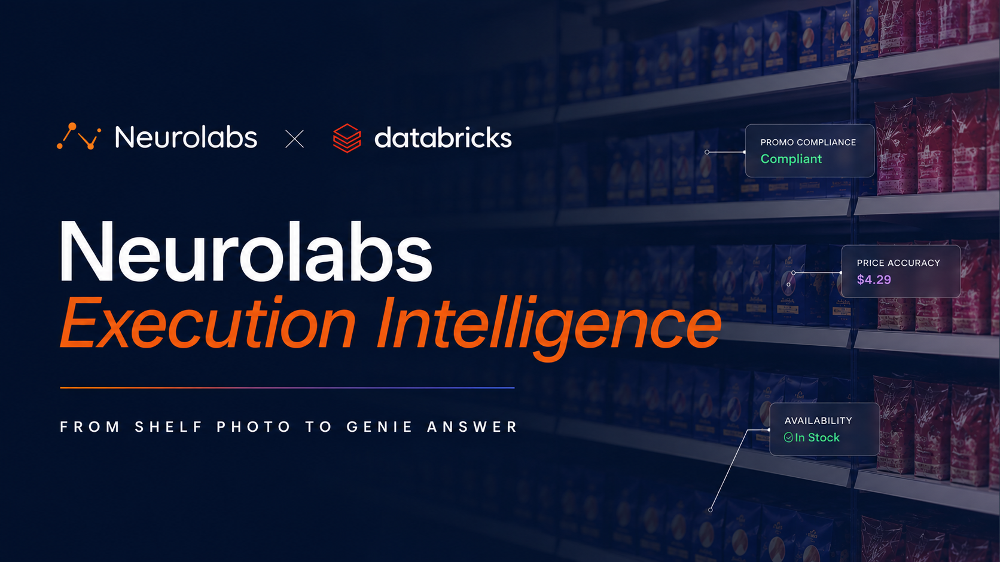

# Neurolabs Execution Intelligence — Marketplace Quickstart

[](https://colab.research.google.com/github/neurolaboratories/zia-insights-dashboard/blob/main/neurolabs_marketplace_quickstart.ipynb)
[](https://console.cloud.google.com/vertex-ai/notebooks/deploy-notebook?download_url=https://raw.githubusercontent.com/neurolaboratories/zia-insights-dashboard/blob/main/neurolabs_marketplace_quickstart.ipynb)
[](https://www.databricks.com/try-databricks)
[](https://github.com/neurolaboratories/zia-insights-dashboard/blob/main/neurolabs_marketplace_quickstart.ipynb)

Neurolabs is building the industry standard for image recognition in the consumer packaged goods (CPG) sector. Our Visual AI platform enables end-to-end visibility across the retail supply chain—from distribution to store execution—using synthetic data and proprietary visual AI models. By delivering scalable, real-time insights from the shelf edge, we help global CPG brands and their partners automate workflows, reduce costs, and drive execution excellence.

Shelf photos become enterprise intelligence, queryable in your lakehouse alongside Nielsen, Circana, Numerator, depletions, and trade spend. 

The Neurolabs Execution Intelligence data product exposes a read-only Gold schema, a solution accelerator notebook, and a Genie space, so a CPG insights or RGM team can ask "Which stores went out-of-stock on Coca-Cola during last week's promo, and what was the revenue impact?" in plain English, no SQL, no six-week lag.

Governed in Unity Catalog. Distributed via Delta Sharing. Production today across millions of images per month, globally. 


**Benefits**

1. Joinable shelf signal. SKU-level on-shelf availability, share of shelf, prices, promotions, displays, and competitor activity, available natively in Unity Catalog and joined to your existing lakehouse data.

2. Time to first insight in 20 minutes. Pre-built Lakeview dashboard and Genie space deploy from a public quickstart notebook. No custom integration required.

3. Closed-loop execution. Shelf reality reconciled with TPM, depletions, and contracts in the same query, the same week the promo runs, not six weeks later.

4. Configurable scoring, via Unity Catalog Metric Views. Brands define their own promotion-specific KPIs (core-product presence, gap penalties, flavor separation, minimum facings) via a simple rules engine over the Gold schema.
5. Enterprise governance. Inherits your Unity Catalog policies. No uncontrolled data movement. 

**Use cases**

- **Shelf & Display Execution**: Capture your entire category at the SKU level across every in-store fixture — primary shelf, end caps, gondolas, FSDUs, free-standing displays, floor stacks, racks, and clip strips. Instantly diagnose shelf KPIs, validate merchandising quality, address sales opportunities, and ensure retailer contract compliance.
- **Promotion Execution & Compliance**: Execute and verify promotional campaigns end to end — detect expected vs actual promotional prices and POSMs per SKU, get visibility into promotional impact, audit and correct execution in real time, and apply best practices across locations.
- **Pricing Execution**: Quickly address pricing gaps with image recognition that extracts and validates pricing for every SKU — ensure pricing and labelling compliance at the SKU level, detect promotional vs standard prices, and action inaccuracies fast.
- **Planogram Compliance**: Cross-reference allocated shelf space with current in-store displays from a single photo — guarantee contract compliance and accurate shelf allocations, fix on-shelf issues quickly, and detect assortment opportunities.
- **Execution Auditing**: Audit and optimise third-party retail execution with a real-time store view — spot gaps in actual vs contracted KPIs, ensure assortment and distribution compliance, and roll learnings across the operation.

**Product details**
The Neurolabs Shelf Intelligence Gold schema is delivered via Delta Sharing as a read-only catalog in the customer's Unity Catalog metastore.

Datasets represented include ***catalog, subsection, promo, shelf, facing, and image*.**
Sample fields include **sku_name, outlet_name, outlet_address, promo_price, and promo_quantity_sold.**
```
┌──────────────────────────────┐┌───────────────────────────┐
│           CATALOG            ││        SUBSECTION         │
├──────────────────────────────┤├───────────────────────────┤
│ PK  catalog_uuid             ││ PK  subsection_uuid       │
│     annotation_catalog_id    ││     subsection_name       │
│     catalog_name             ││     lat / lng             │
│     catalog_brand            ││     city                  │
│     catalog_container_type   ││     region                │
│     catalog_flavour          ││     country_code          │
│     catalog_size             ││     retail_outlet_name    │
│     trading_location         ││     campaign_name         │
│     parent_company           ││     store_name            │
│     category_of_goods        │└────────────┬──────────────┘
│     sub_brand                │	         │
│     props_operational_cat    │	         │ subsection_uuid
│     props_client_name        │	         │
│     props_client_category    │	         │
│     annotation_type          │	         │
│     is_competitor            │	         │
│     rrp / largest / cheapest │	         │
└──────────────┬───────────────┘	         │
	           │			                 │
	           │ catalog_uuid		         │
		       └───────────────┬─────────────┘
				               │
				               ▼
┌────────────────────────────────────────────────────────────────────────┐
│                             FACING                                     │
│                        (central spine table)                           │
├────────────────────────────────────────────────────────────────────────┤
│ FK  catalog_uuid            ─────────────────────────────► CATALOG     │
│ FK  subsection_uuid         ─────────────────────────────► SUBSECTION  │
│ FK  result_uuid             ─────────────────────────────► IMAGE/SHELF │
│ FK  realogram_item_shelf_id ─────────────────────────────► SHELF       │
│ FK  price_uuid              ─────────────────────────────► PROMO       │
│     has_price                                                          │
│     has_promo                                                          │
│     facings_in_shelf                                                   │
│     share_of_shelf                                                     │
│     sku_blocks_in_shelf                                                │
│     any_crop_x/y/w/h                                                   │
└──────────┬─────────────────────────────┬──────────────────┬────────────┘
	       │		   	                 │		            │
	       │ result_uuid+catalog_uuid    │ result_uuid      │ catalog_uuid
	       │			                 │ +shelf_id        │ +price_uuid
	       ▼				             ▼		            ▼
┌──────────────────────┐	┌───────────────────────┐┌──────────────────────┐
│        IMAGE         │	│        SHELF          ││        PROMO         │
├──────────────────────┤	├───────────────────────┤├──────────────────────┤
│ PK  catalog_uuid     │	│ PK  result_uuid       ││ PK  catalog_uuid     │
│ PK  result_uuid      │	│ PK  realogram_item    ││ PK  price_uuid       │
│     result_image_url │	│       _shelf_id       ││     price            │
│     result_original  │	│     unknown_facings   ││     quantity         │
│       _image_url     │	│     known_facings     ││     promo_start      │
│     task_uuid        │	│     gap_facings       ││     promo_end        │
│     sku_at_eye_level │	│     distinct_facings  ││     promo_weeks      │
│     distinct_brand_  │	│     distinct_brands   ││     promos_seen      │
│       facings        │	│     unknown_in_shelf  ││     strip_name       │
│     total_brand_*    │	│                       ││     poster_name      │
│     total_sku_*      │	│                       ││     strip_crop_*     │
│                      │	│                       ││     poster_crop_*    │
│                      │	│                       ││     promo_crop_*     │
└──────────────────────┘	└───────────────────────┘└──────────────────────┘
```
For more details, refer to the embedded notebook (Marketplace quickstart — clones the public neurolabs/zia-insights-dashboard repo, attaches the Delta Share, deploys the Lakeview dashboard, and provisions a Genie space in three notebook cells).

**Additional Insights**

- [Partner page](https://marketplace.databricks.com/provider/5cbe97ed-c6bd-403c-84be-7028d2493fac/Neurolabs): Overview, dashboard preview, and a 60-second Genie demo video.
- [Public quickstart repo](https://github.com/neurolaboratories/zia-insights-dashboard): Lakeview dashboard JSON, Genie deploy script, and five enrichment recipes (sales, cost, Nielsen catchment demographics, marketing attribution, channel mix).
- Customer evidence: [How AG Barr cut store audit time by 50% with Visual AI](https://www.neurolabs.ai/post/driving-retail-excellence-how-ag-barr-cut-store-audit-time-by-50-with-visual-ai) — production deployment of the same recognition stack that powers this listing.
- Category research: [Execution Intelligence and the World Cup 2026 promotional wave](https://www.neurolabs.ai/events/webinars-execution-intelligence-world-cup-2026)— joint webinar with Filip Luneski (ex-AB InBev, Coca-Cola, Molson Coors) and Bryan Smith (Databricks Global Head of Industry Solutions, Consumer Industries) sizing the 60–70% promotional-display failure rate that motivates this data product.
- Pricing model: free tier on Marketplace for discovery and the solution accelerator. Usage-based for production deployments.
